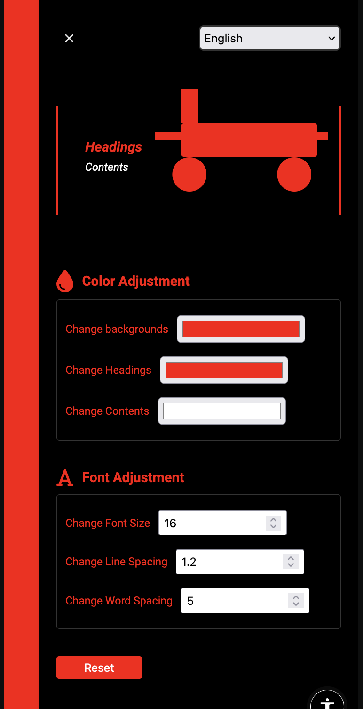

<div align="center">
  <a href="https://github.com/nextjs-architecture">
    
  </a>
</div>

<h1 align="center">React-a11y-config(React Accessibility Configurator)</h1>
<br />

React-a11y-config is a comprehensive accessibility configuration tool designed for React applications. It empowers developers to enhance the accessibility of their web applications, providing users with a more inclusive and customizable experience.

*Features*
React-a11y-config offers a suite of powerful accessibility features:

- Text Configuration: Customize text properties to improve readability for all users.
- Color Configuration: Adjust color schemes to accommodate various visual needs and preferences.
- Voice Configuration: Implement voice-related settings for enhanced audio interaction.

## Installation

To install React-a11y-config, run the following command in your project directory:

```bash
npm install react-a11y-config

or

yarn add react-a11y-config
```

## Usage

Here's an example of how to integrate React-a11y-config into your React application:

```bash
import { A11yConfig } from 'react-a11y-config';

function App() {
  return (
    <A11yConfig/>
  );
}
```

## Sample




